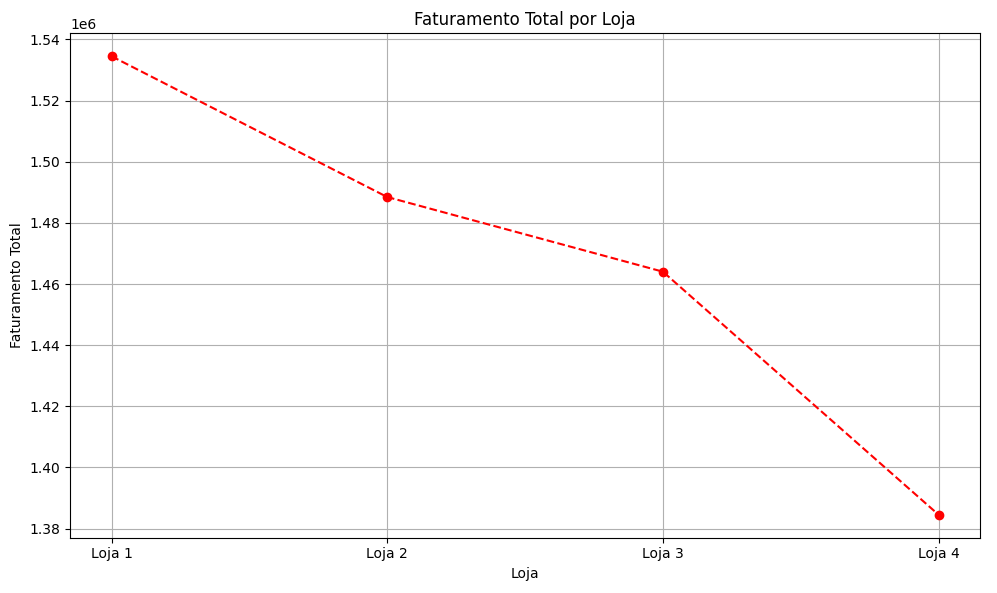
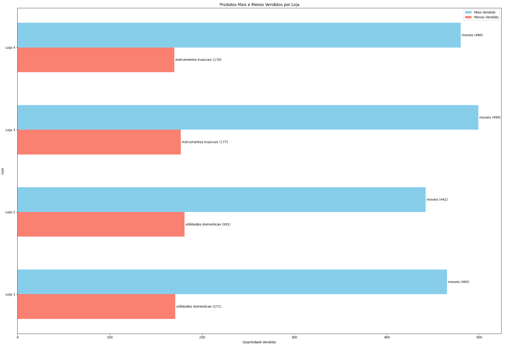
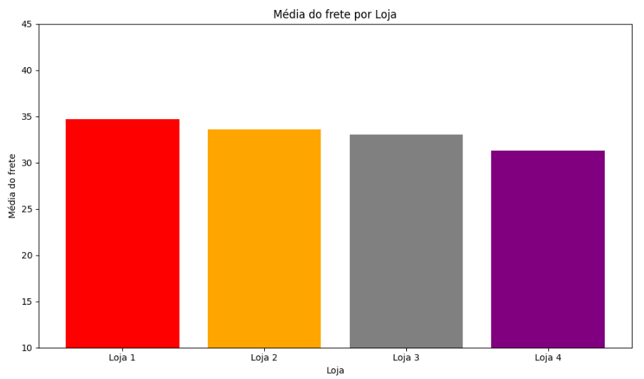

# Alura Store - Challenge

## Introdução ao projeto

Este projeto consiste na análise de dados das lojas da Alura Store, com o objetivo de auxiliar o Sr. João na decisão de qual loja vender para investir em um novo negócio.

## Principais atividades desenvolvidas

- Análise do faturamento total de cada loja.
- Identificação das categorias de produtos mais populares.
- Cálculo da média de avaliação dos clientes.
- Análise dos produtos mais e menos vendidos.
- Avaliação do custo médio do frete.
- Geração de gráficos para visualização dos resultados.
- Elaboração de um relatório final com a recomendação da loja a ser vendida, baseada nos dados analisados.

## Exemplos de gráficos e insights obtidos

- **Faturamento total de cada loja:** 
  

- **Produtos mais e menos vendidos:** 
  

- **Custo médio do frete por loja:** 
  

## Estrutura do projeto

- `loja.csv/loja2.csv/loja3.csv/loja4.csv` – Arquivos de dados utilizados na análise.
- `AluraStoreBrasil.ipynb/` – Notebook Jupyter/Colab com o código da análise e geração dos gráficos.
- `ImagensGraficos/` – Imagens dos gráficos gerados.
- `README.md` – Arquivo explicativo.

## Ferramentas utilizadas

- Google Colab
- Python
- Pandas
- Matplotlib

## Como executar a análise

1. Clone o repositório:
   ```bash
   git clone https://github.com/hagatchristie/alura-store-challenge.git
   ```
2. Para rodar o notebook localmente, instale as seguintes bibliotecas Python:

   ```bash
   pip install pandas matplotlib
   ```
Obs.: No Google Colab, estas bibliotecas já estão disponíveis e não é necessário instalar nada além.


3. Abra o notebook no Google Colab ou Jupyter:

   ```bash
   jupyter notebook AluraStoreBrasil.ipynb
   ```

4. Execute o notebook principal (`AluraStoreBrasil.ipynb`) para reproduzir a análise e visualizar os gráficos e recomendações.
